<h1 align="center">
  Multitask Evolutionary Level Generation for Procedural Content Generation
</h1>

This repository contains the complete set of levels generated during our research on MultiTask Evolutionary for Procedural Content Generation (PCG), tested on the [PCG Benchmark](https://github.com/amidos2006/pcg_benchmark).

## Repository structure
The data is organized into two main scenarios. Both scenarios utilize the same three fitness criteria taken from the benchmark to evaluate the generated content. 
Note: For each criterion, we provide the three best representative levels to demonstrate the consistency and quality of the generator.

- **Scenario 1:** Fully compatible multitasking environment
  * Included levels generated by Genetic Algorithm (GA) and Multifactorial Evolutionary Algorithm (MFEA).
  * MFEA levels are generated simultaneously for different instances within one problem set.
    
- **Scenario 2:** Content-compatible multitasking environment
  * Included levels generated by MFEA only.
  * This scenario examines knowledge transfer within the multitask approach in environments sharing a common representational search space.

## File naming convention

Files are named to provide immediate context regarding their origin: [_Algorithm_]\_[_Problem_]\_[_Metric_]\_[_number_].png 
- _Algorithm_: ga or mfea.
- _Problem_: The specific game instance (e.g., `ddave-v0`).
- _Metric_: quality, quality_control, or quality_control_diversity.
- _Number_: 1, 2, or 3 (representing the top 3 individuals).

Example: ga_arcade-large-v0_quality_1.png refers to a level generated for the instance arcade-large-v0 of Arcade problems using GA under the Quality metric.

## Examples of Generated Content
These are some representatives of the generated content for all problems in the framework. More examples can be found in [images](images/) folder.
| Problem | GA | MFEA |
| ---- | ------ | ------------------ |
| `arcade-v0` | 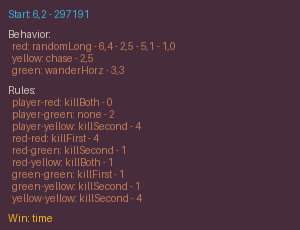 | 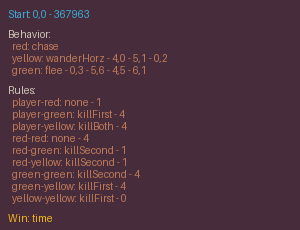 |
| `binary-v0` | 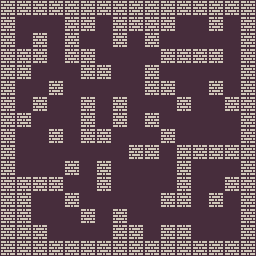 | 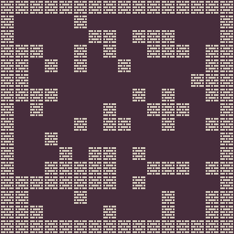 |
| `building-v0` |  | 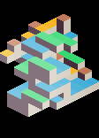 |
| `ddave-v0` | 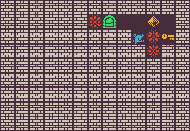 | 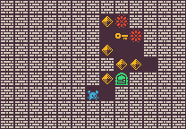 |
| `elimination-v0` |  |  |
| `isaac-v0` | 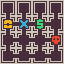 |  |
| `loderunner-v0` | 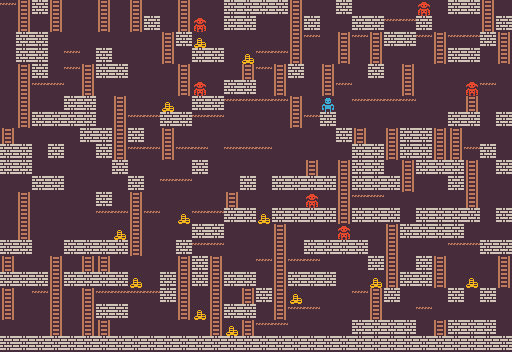 | 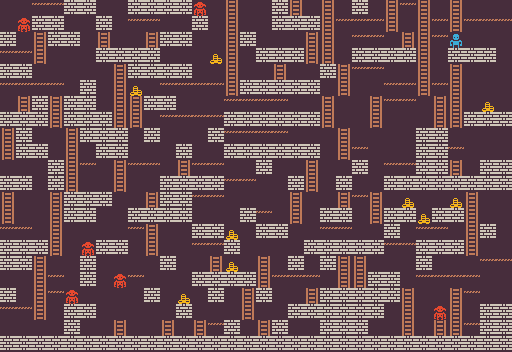 |
| `mdungeons-v0` | 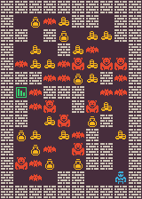 | 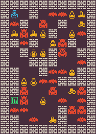 |
| `smb-v0` |  | 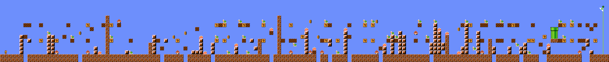 |
| `sokoban-v0` | 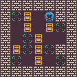 | 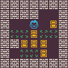 |
| `talakat-v0` |  |  |
| `zelda-v0` | 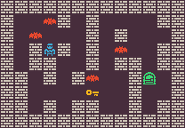 | 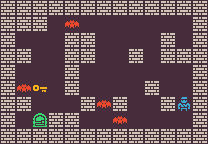 |

## License
This code is available as open source under the terms of the [MIT License](https://opensource.org/licenses/MIT).
